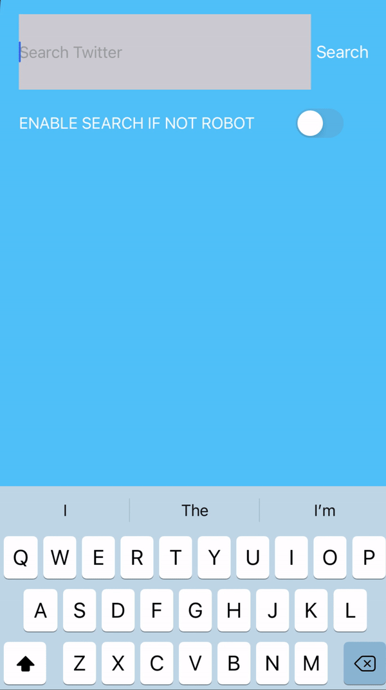

Twitter API that connects UICollectionView for tweet search

You must possess your own bearer token (from Twitter Developer) and input it as a string in :
let bearerToken = ""

Otherwise, the screen will be black.

